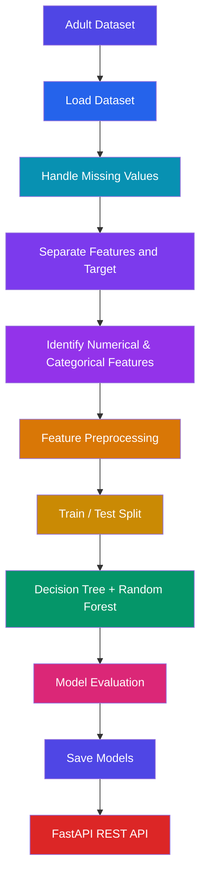

# Assignment 5 — REST API using FastAPI

## Problem Statement

Create a REST API using **FastAPI** for a Machine Learning application. The API should support different HTTP operations such as **GET, POST, PUT, PATCH, and DELETE**.

The application uses Machine Learning models trained on the **Adult Income dataset** to predict whether a person's income is `<=50K` or `>50K`.

Two classification algorithms are implemented:

* Decision Tree Classifier
* Random Forest Classifier

---

## Objectives

* Load and preprocess the Adult Income dataset.
* Perform feature preprocessing for numerical and categorical data.
* Train Decision Tree and Random Forest classification models.
* Evaluate the trained models using accuracy.
* Save the trained ML models.
* Create a REST API using FastAPI.
* Implement GET, POST, PUT, PATCH, and DELETE operations.
* Test the API using FastAPI Swagger UI.
* Manage the project using Git and GitHub.

---

## Dataset

The project uses the **Adult Income Dataset**.

Each record contains information such as:

* Age
* Workclass
* Final Weight
* Education
* Education Number
* Marital Status
* Occupation
* Relationship
* Race
* Sex
* Capital Gain
* Capital Loss
* Hours per Week
* Native Country

### Target Variable

The target variable is:

```text
income
```

Possible values:

```text
<=50K
>50K
```

The dataset is stored at:

```text
data/adult.csv
```

---

## Technologies Used

* Python
* FastAPI
* Uvicorn
* Pandas
* Scikit-learn
* Joblib
* Pydantic
* Git
* GitHub

---

## Machine Learning Workflow

The following workflow was implemented:



---

## Data Preprocessing

Missing values represented by `?` are converted to missing values and rows containing missing values are removed.

### Categorical Features

Categorical features are processed using:

```python
OneHotEncoder(handle_unknown="ignore")
```

### Numerical Features

Numerical features are scaled using:

```python
StandardScaler()
```

Both transformations are combined using:

```python
ColumnTransformer
```

The preprocessing and ML model are combined using a Scikit-learn:

```python
Pipeline
```

---

## Machine Learning Models

### 1. Decision Tree Classifier

The Decision Tree algorithm creates a tree-like structure to make classification decisions.

Implementation:

```python
DecisionTreeClassifier(random_state=42)
```

### 2. Random Forest Classifier

Random Forest combines multiple decision trees and uses their predictions to perform classification.

Implementation:

```python
RandomForestClassifier(
    n_estimators=100,
    random_state=42,
    n_jobs=-1
)
```

---

## Model Results

The models were evaluated using accuracy on the test dataset.

| Model         |   Accuracy |
| ------------- | ---------: |
| Decision Tree | **81.40%** |
| Random Forest | **85.02%** |

The trained models are saved as:

```text
models/decision_tree_model.pkl
models/random_forest_model.pkl
```

---

# FastAPI REST API

The API is implemented in:

```text
main.py
```

The application provides the following endpoints.

---

## 1. GET `/`

Checks whether the API is running.

### Response

```json
{
  "message": "Adult Income Prediction API is running",
  "status": "success"
}
```

---

## 2. GET `/models`

Returns information about the available ML models.

### Response

```json
{
  "models": [
    "Decision Tree",
    "Random Forest"
  ],
  "purpose": "Adult Income Prediction",
  "status": "loaded"
}
```

---

## 3. POST `/predict`

Accepts a person's information and generates predictions using both ML models.

### Example Request

```json
{
  "age": 39,
  "workclass": "State-gov",
  "fnlwgt": 77516,
  "education": "Bachelors",
  "education_num": 13,
  "marital_status": "Never-married",
  "occupation": "Adm-clerical",
  "relationship": "Not-in-family",
  "race": "White",
  "sex": "Male",
  "capital_gain": 2174,
  "capital_loss": 0,
  "hours_per_week": 40,
  "native_country": "United-States"
}
```

### Response

The API returns predictions from:

* Decision Tree
* Random Forest

---

## 4. GET `/predictions`

Returns the prediction records currently stored by the API.

### Example

```json
{
  "total_predictions": 1,
  "predictions": {}
}
```

---

## 5. PUT `/predictions/{prediction_id}`

Completely updates or creates a prediction record for the specified ID.

### Example

```http
PUT /predictions/1
```

`PUT` replaces the complete prediction data for the specified record.

---

## 6. PATCH `/predictions/{prediction_id}`

Updates an existing prediction record.

### Example

```http
PATCH /predictions/1
```

`PATCH` is used for modifying an existing resource.

---

## 7. DELETE `/predictions/{prediction_id}`

Deletes a prediction record.

### Example

```http
DELETE /predictions/1
```

### Response

```json
{
  "message": "Prediction deleted successfully",
  "prediction_id": 1
}
```

---

# API Testing

FastAPI automatically provides interactive Swagger documentation.

After starting the server:

```bash
uvicorn main:app --reload
```

Open Swagger UI:

**http://127.0.0.1:8000/docs**

The Swagger UI was used to test:

* GET
* POST
* PUT
* PATCH
* DELETE

---

# Project Structure

```text
Assignment-5/
│
├── data/
│   └── adult.csv
│
├── models/
│   ├── decision_tree_model.pkl
│   └── random_forest_model.pkl
│
├── main.py
├── train.py
├── requirements.txt
├── .gitignore
└── README.md
```

---

# How to Run the Project

## 1. Create and activate virtual environment

### Linux / macOS

```bash
python3 -m venv .venv
source .venv/bin/activate
```

### Windows

```bash
python -m venv .venv
.venv\Scripts\activate
```

---

## 2. Install dependencies

```bash
pip install -r requirements.txt
```

---

## 3. Train the models

```bash
python train.py
```

This trains both models and saves them inside the `models` directory.

---

## 4. Start FastAPI

```bash
uvicorn main:app --reload
```

---

## 5. Open Swagger UI

**http://127.0.0.1:8000/docs**

---

# Files Description

## `train.py`

Responsible for:

* Loading the dataset
* Data cleaning
* Feature preprocessing
* Train/test split
* Training Decision Tree
* Training Random Forest
* Model evaluation
* Saving trained models

---

## `main.py`

Responsible for:

* Starting the FastAPI application
* Loading trained models
* Defining request data models
* Performing predictions
* Implementing REST API endpoints
* Handling GET, POST, PUT, PATCH, and DELETE operations

---

## `models/`

Contains the trained Machine Learning models.

---

## `data/`

Contains the Adult Income dataset.

---

# Conclusion

This assignment demonstrates the integration of Machine Learning with REST API development using FastAPI.

Decision Tree and Random Forest classifiers were trained on the Adult Income dataset and exposed through API endpoints.

The project implements all major REST operations including **GET, POST, PUT, PATCH, and DELETE** and provides interactive API testing through Swagger UI.

The assignment demonstrates a basic **MLOps workflow** from data preprocessing and model training to model serving through a REST API.
