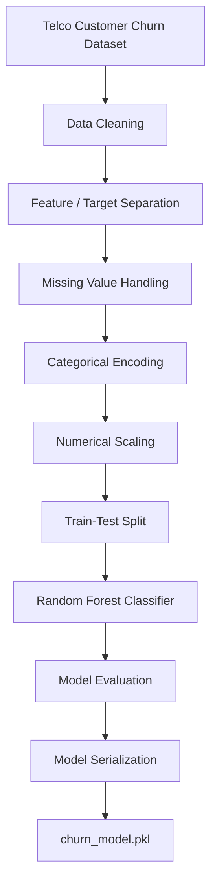
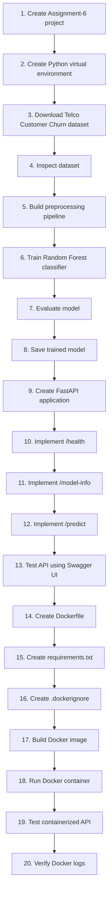

# Assignment 6 — Containerized ML Prediction Service

## Customer Churn Prediction using FastAPI and Docker

---

## 1. Problem Statement

Build and deploy a machine learning prediction service that identifies customers who are likely to churn.

The project uses the **Telco Customer Churn dataset**, containing approximately 7,000 customer records with demographic, service usage, contract, and billing information.

The trained machine learning model is exposed through a **FastAPI REST API** and completely containerized using **Docker**, allowing the application to run without requiring local Python or ML-library installation.

---

## 2. Objectives

The main objectives of this assignment are:

* Preprocess the Telco Customer Churn dataset.
* Handle missing values.
* Encode categorical variables.
* Scale numerical features.
* Train a classification model.
* Save the trained model for reuse.
* Build a REST API using FastAPI.
* Provide prediction and model information endpoints.
* Containerize the ML service using Docker.
* Run the service on port `8000`.
* Use `.dockerignore` to reduce unnecessary Docker build context.
* Verify the complete ML prediction workflow inside a Docker container.

---

## 3. Technologies Used

| Technology     | Purpose                                     |
| -------------- | ------------------------------------------- |
| Python         | Machine Learning and API development        |
| Pandas         | Dataset loading and preprocessing           |
| NumPy          | Numerical operations                        |
| Scikit-learn   | ML preprocessing, pipeline and model        |
| Random Forest  | Customer churn classification               |
| Joblib         | Model serialization                         |
| FastAPI        | REST API development                        |
| Uvicorn        | ASGI server                                 |
| Docker         | Application containerization                |
| Docker Desktop | Docker engine and WSL integration           |
| Ubuntu / WSL   | Linux-based development and Docker commands |
| VS Code        | Code development                            |

---

## 4. Dataset

### Telco Customer Churn Dataset

The dataset contains customer information such as:

* Gender
* Senior citizen status
* Partner
* Dependents
* Tenure
* Phone service
* Internet service
* Online security
* Online backup
* Device protection
* Technical support
* Streaming services
* Contract type
* Paperless billing
* Payment method
* Monthly charges
* Total charges

### Target Variable

The target variable is:

```text
Churn
```

Possible values:

```text
Yes
No
```

For machine learning:

```text
Yes → 1
No  → 0
```

### Dataset Size

```text
7043 records
21 original columns
```

After removing `customerID`:

```text
7043 records
20 columns
```

---

## 5. Project Structure

```text
Assignment-6/
│
├── app/
│   └── main.py
│
├── data/
│   └── telco_churn.csv
│
├── models/
│   └── churn_model.pkl
│
├── .dockerignore
├── .venv/
├── Dockerfile
├── README.md
├── requirements.txt
└── train_model.py
```

### Important Files

#### `train_model.py`

Responsible for:

* Loading the dataset
* Data preprocessing
* Feature engineering
* Model training
* Model evaluation
* Saving the trained model

#### `app/main.py`

Responsible for:

* Loading the trained model
* Creating the FastAPI application
* Defining API endpoints
* Receiving customer data
* Generating churn predictions

#### `Dockerfile`

Defines how the ML API is packaged into a Docker image.

#### `requirements.txt`

Contains the Python dependencies required by the application.

#### `.dockerignore`

Prevents unnecessary files from being copied into the Docker build context.

---

## 6. Machine Learning Pipeline

The ML pipeline consists of the following stages:

```text
Dataset
   ↓
Data Cleaning
   ↓
Feature / Target Separation
   ↓
Missing Value Handling
   ↓
Categorical Encoding
   ↓
Numerical Scaling
   ↓
Train-Test Split
   ↓
Random Forest Classifier
   ↓
Model Evaluation
   ↓
Model Serialization
```

### ML Pipeline Diagram



---

## 7. Data Preprocessing

### 7.1 Convert TotalCharges

The `TotalCharges` column can contain blank values, so it is converted into numeric format.

```python
df["TotalCharges"] = pd.to_numeric(
    df["TotalCharges"],
    errors="coerce"
)
```

Invalid values are converted into `NaN` and handled later by the imputer.

### 7.2 Remove Customer ID

`customerID` is an identifier and does not provide useful predictive information.

```python
df = df.drop(columns=["customerID"])
```

### 7.3 Encode Target Variable

The `Churn` target is converted from text to binary values:

```python
df["Churn"] = df["Churn"].map({
    "Yes": 1,
    "No": 0
})
```

---

## 8. Feature Preprocessing

The features are divided into:

### Numerical Features

Examples:

* `SeniorCitizen`
* `tenure`
* `MonthlyCharges`
* `TotalCharges`

### Numerical Preprocessing

```python
numerical_pipeline = Pipeline(
    steps=[
        ("imputer", SimpleImputer(strategy="median")),
        ("scaler", StandardScaler()),
    ]
)
```

This performs:

* Missing value replacement using the median.
* Standardization using `StandardScaler`.

### Categorical Features

Examples:

* `gender`
* `Partner`
* `Dependents`
* `InternetService`
* `Contract`
* `PaymentMethod`

### Categorical Preprocessing

```python
categorical_pipeline = Pipeline(
    steps=[
        ("imputer", SimpleImputer(strategy="most_frequent")),
        ("encoder", OneHotEncoder(handle_unknown="ignore")),
    ]
)
```

This performs:

* Missing value replacement using the most frequent value.
* One-hot encoding of categorical variables.

`handle_unknown="ignore"` allows the API to handle previously unseen categorical values safely.

---

## 9. ColumnTransformer

The numerical and categorical preprocessing pipelines are combined using `ColumnTransformer`.

```python
preprocessor = ColumnTransformer(
    transformers=[
        ("num", numerical_pipeline, numerical_features),
        ("cat", categorical_pipeline, categorical_features),
    ]
)
```

This allows different preprocessing operations to be applied to different feature types.

---

## 10. Machine Learning Model

A **Random Forest Classifier** was used for customer churn classification.

```python
model = RandomForestClassifier(
    n_estimators=100,
    random_state=42
)
```

### Important Parameters

| Parameter      | Value | Purpose                  |
| -------------- | ----: | ------------------------ |
| `n_estimators` |   100 | Number of decision trees |
| `random_state` |    42 | Reproducible results     |

---

## 11. Complete ML Pipeline

The preprocessing and model are combined into a single Scikit-learn pipeline.

```python
pipeline = Pipeline(
    steps=[
        ("preprocessor", preprocessor),
        ("classifier", model),
    ]
)
```

This is important because the exact same preprocessing used during training is automatically applied when making predictions through the API.

---

## 12. Train-Test Split

The dataset was divided into training and testing data.

```python
X_train, X_test, y_train, y_test = train_test_split(
    X,
    y,
    test_size=0.2,
    random_state=42,
    stratify=y
)
```

### Dataset Split

```text
Total records:       7043
Training records:    5634
Testing records:     1409
```

The test set represents 20% of the dataset.

`stratify=y` maintains the class distribution between training and testing datasets.

---

## 13. Model Results

The trained Random Forest model achieved:

```text
Accuracy: 0.7779
```

Therefore:

```text
Accuracy ≈ 77.79%
```

### Classification Report

```text
              precision    recall  f1-score   support

           0       0.82      0.89      0.85      1035
           1       0.60      0.48      0.53       374

    accuracy                           0.78      1409
   macro avg       0.71      0.68      0.69      1409
weighted avg       0.77      0.78      0.77      1409
```

---

## 14. Model Persistence

The complete ML pipeline is saved using Joblib.

```python
joblib.dump(
    pipeline,
    "models/churn_model.pkl"
)
```

The resulting model file is:

```text
models/churn_model.pkl
```

The saved pipeline contains both:

```text
Preprocessing
+
Random Forest Model
```

Therefore, the API does not need to retrain the model.

---

## 15. FastAPI REST API

The trained model is exposed through a FastAPI application.

The API provides three required endpoints.

### 15.1 `GET /health`

Checks whether the API and model are available.

#### Example

```text
GET /health
```

#### Response

```json
{
  "status": "healthy",
  "model_loaded": true
}
```

---

### 15.2 `GET /model-info`

Returns information about the trained model.

#### Example

```text
GET /model-info
```

#### Response

```json
{
  "model": "Random Forest Classifier",
  "dataset": "Telco Customer Churn",
  "target": "Churn",
  "accuracy": 0.7779,
  "version": "1.0"
}
```

---

### 15.3 `POST /predict`

Accepts customer information and returns a churn prediction.

#### Example Request

```json
{
  "gender": "Male",
  "SeniorCitizen": 0,
  "Partner": "Yes",
  "Dependents": "No",
  "tenure": 12,
  "PhoneService": "Yes",
  "MultipleLines": "No",
  "InternetService": "Fiber optic",
  "OnlineSecurity": "No",
  "OnlineBackup": "No",
  "DeviceProtection": "No",
  "TechSupport": "No",
  "StreamingTV": "Yes",
  "StreamingMovies": "Yes",
  "Contract": "Month-to-month",
  "PaperlessBilling": "Yes",
  "PaymentMethod": "Electronic check",
  "MonthlyCharges": 85.5,
  "TotalCharges": 1026.0
}
```

#### Example Response

```json
{
  "churn_prediction": "Yes",
  "churn_probability": 0.63
}
```

---

## 16. FastAPI Prediction Logic

The important prediction code is:

```python
@app.post("/predict")
def predict(customer: CustomerData):

    data = pd.DataFrame([customer.model_dump()])

    prediction = model.predict(data)[0]
    probability = model.predict_proba(data)[0][1]

    churn_prediction = "Yes" if prediction == 1 else "No"

    return {
        "churn_prediction": churn_prediction,
        "churn_probability": round(float(probability), 4)
    }
```

The API:

1. Receives customer information.
2. Converts it into a Pandas DataFrame.
3. Passes it through the saved ML pipeline.
4. Generates the prediction.
5. Calculates the probability of churn.
6. Returns the result as JSON.

---

## 17. FastAPI Documentation

FastAPI automatically provides interactive API documentation using Swagger UI.

The documentation can be accessed at:

```text
http://127.0.0.1:8000/docs
```

This was used to test:

```text
GET  /health
GET  /model-info
POST /predict
```

---

## 18. Docker Containerization

The ML prediction service was containerized using Docker.

The main goal of containerization is to package:

```text
Application Code
+
ML Model
+
Python Dependencies
+
Runtime Environment
```

into a portable Docker image.

This allows the application to run consistently on another machine without manually installing the ML libraries and Python environment.

---

## 19. Dockerfile

The important Dockerfile configuration is:

```dockerfile
FROM python:3.11-slim

WORKDIR /app

COPY requirements.txt .

RUN pip install --no-cache-dir -r requirements.txt

COPY app/ ./app/
COPY models/ ./models/

EXPOSE 8000

CMD ["uvicorn", "app.main:app", "--host", "0.0.0.0", "--port", "8000"]
```

### Explanation

#### Base Image

```dockerfile
FROM python:3.11-slim
```

Uses a lightweight Python image.

#### Working Directory

```dockerfile
WORKDIR /app
```

Sets `/app` as the working directory inside the container.

#### Install Dependencies

```dockerfile
COPY requirements.txt .

RUN pip install --no-cache-dir -r requirements.txt
```

Copies and installs the required Python libraries.

#### Copy Application

```dockerfile
COPY app/ ./app/
```

Copies the FastAPI application.

#### Copy Model

```dockerfile
COPY models/ ./models/
```

Copies the trained ML model into the container.

#### Expose Port

```dockerfile
EXPOSE 8000
```

Documents the port used by the FastAPI application.

#### Start Application

```dockerfile
CMD [
    "uvicorn",
    "app.main:app",
    "--host",
    "0.0.0.0",
    "--port",
    "8000"
]
```

Starts the FastAPI server when the container runs.

---

## 20. Docker Dependencies

The `requirements.txt` file contains:

```text
fastapi
uvicorn
pandas
scikit-learn
joblib
```

These packages are installed inside the Docker image.

---

## 21. `.dockerignore`

The `.dockerignore` file prevents unnecessary files from being included in the Docker build context.

```text
.venv/
__pycache__/
*.pyc
.git/
.gitignore
data/
*.ipynb
README.md
```

The dataset is excluded because it is only required during model training.

The trained model is included because the API needs it for prediction.

---

## 22. Docker Image

The Docker image was created using:

```bash
docker build -t customer-churn-api .
```

The resulting image:

```text
customer-churn-api:latest
```

was successfully created.

---

## 23. Running the Docker Container

The container was started using:

```bash
docker run -d \
  --name customer-churn-container \
  -p 8000:8000 \
  customer-churn-api
```

### Command Explanation

#### `-d`

Runs the container in detached/background mode.

#### `--name customer-churn-container`

Assigns a name to the container.

#### `-p 8000:8000`

Maps host port `8000` to container port `8000`.

#### `customer-churn-api`

Specifies the Docker image to run.

---

## 24. Verify Running Container

The container can be checked using:

```bash
docker ps
```

Expected output includes:

```text
customer-churn-container
```

with port mapping:

```text
0.0.0.0:8000->8000/tcp
```

---

## 25. Testing the Containerized API

### Swagger UI

```text
http://127.0.0.1:8000/docs
```

The following endpoints were successfully tested inside the Docker container:

```text
GET  /health
GET  /model-info
POST /predict
```

### Health Test

```json
{
  "status": "healthy",
  "model_loaded": true
}
```

### Model Information Test

```json
{
  "model": "Random Forest Classifier",
  "dataset": "Telco Customer Churn",
  "target": "Churn",
  "accuracy": 0.7779,
  "version": "1.0"
}
```

### Prediction Test

```json
{
  "churn_prediction": "Yes",
  "churn_probability": 0.63
}
```

All three endpoints returned successful HTTP `200` responses.

---

## 26. Important Docker Commands Used

### Check Docker Installation

```bash
docker --version
```

### Test Docker Installation

```bash
docker run hello-world
```

### Build Image

```bash
docker build -t customer-churn-api .
```

### List Docker Images

```bash
docker images
```

### Run Container

```bash
docker run -d \
  --name customer-churn-container \
  -p 8000:8000 \
  customer-churn-api
```

### List Running Containers

```bash
docker ps
```

### View Container Logs

```bash
docker logs customer-churn-container
```

### Stop Container

```bash
docker stop customer-churn-container
```

### Remove Container

```bash
docker rm customer-churn-container
```

---

## 27. Important Python Commands Used

### Create Virtual Environment

```bash
python3 -m venv .venv
```

### Activate Virtual Environment

```bash
source .venv/bin/activate
```

### Install ML Libraries

```bash
pip install pandas numpy scikit-learn joblib
```

### Install API Libraries

```bash
pip install fastapi uvicorn
```

### Train the Model

```bash
python train_model.py
```

### Run FastAPI Locally

```bash
uvicorn app.main:app --reload
```

---

## 28. MLOps Concepts Implemented

This assignment demonstrates several important MLOps concepts.

### 28.1 Reproducible Environment

A Python virtual environment was used during development.

```text
.venv/
```

This isolates project dependencies from the system Python environment.

### 28.2 Machine Learning Pipeline

The project uses a Scikit-learn pipeline to combine:

```text
Data Preprocessing
+
Feature Transformation
+
Machine Learning Model
```

This helps ensure consistent preprocessing during both training and inference.

### 28.3 Model Serialization

The trained model is persisted using Joblib:

```text
models/churn_model.pkl
```

This means the API can load an already-trained model instead of retraining every time the service starts.

### 28.4 Model Serving

FastAPI acts as the model-serving layer.

```text
Client
   ↓
FastAPI
   ↓
Saved ML Pipeline
   ↓
Prediction
   ↓
JSON Response
```

### 28.5 Containerization

Docker packages the application, model, dependencies, and runtime environment together.

```text
Docker Image
    ↓
Docker Container
    ↓
FastAPI Service
    ↓
ML Model
```

This improves portability and reduces environment-related problems when deploying the service on another machine.

### 28.6 API-based Inference

Instead of directly running the Python model code, users can send HTTP requests to the prediction service.

Example:

```text
POST /predict
```

This is a common architecture for deploying ML models as production services.

---

## 29. End-to-End Architecture

```mermaid
flowchart TD
    A[Telco Customer Churn Dataset] --> B[Data Preprocessing]
    B --> C[Scikit-learn ML Pipeline]
    C --> D[Random Forest Classifier]
    D --> E[churn_model.pkl]
    E --> F[FastAPI Application]

    F --> G[/health]
    F --> H[/model-info]
    F --> I[/predict]

    I --> J[Churn Prediction]
    J --> K[JSON Response]

    F --> L[Docker Container]
    L --> M[Port 8000]
```

### Architecture Flow

```text
                   Telco Customer Churn Dataset
                              │
                              ▼
                        Data Preprocessing
                              │
                              ▼
                    Scikit-learn ML Pipeline
                              │
                              ▼
                   Random Forest Classifier
                              │
                              ▼
                        churn_model.pkl
                              │
                              ▼
                       FastAPI Application
                              │
               ┌──────────────┼──────────────┐
               │              │              │
               ▼              ▼              ▼
            /health       /model-info      /predict
                                             │
                                             ▼
                                      Churn Prediction
                                             │
                                             ▼
                                        JSON Response
                              │
                              ▼
                        Docker Container
                              │
                              ▼
                           Port 8000
```

---

## 30. Assignment Workflow

The complete workflow followed in this assignment was:



### Complete Workflow

1. Create Assignment-6 project
2. Create Python virtual environment
3. Download Telco Customer Churn dataset
4. Inspect dataset
5. Build preprocessing pipeline
6. Train Random Forest classifier
7. Evaluate model
8. Save trained model
9. Create FastAPI application
10. Implement `/health`
11. Implement `/model-info`
12. Implement `/predict`
13. Test API using Swagger UI
14. Create Dockerfile
15. Create `requirements.txt`
16. Create `.dockerignore`
17. Build Docker image
18. Run Docker container
19. Test containerized API
20. Verify Docker logs

---

## 31. Final Results

### Machine Learning

| Metric           | Result                   |
| ---------------- | ------------------------ |
| Dataset          | Telco Customer Churn     |
| Records          | 7043                     |
| Training samples | 5634                     |
| Testing samples  | 1409                     |
| Model            | Random Forest Classifier |
| Accuracy         | 77.79%                   |

### API

| Endpoint          | Status  |
| ----------------- | ------- |
| `GET /health`     | Working |
| `GET /model-info` | Working |
| `POST /predict`   | Working |

### Docker

| Component    | Result                      |
| ------------ | --------------------------- |
| Docker Image | `customer-churn-api:latest` |
| Container    | `customer-churn-container`  |
| Port         | `8000`                      |

The complete ML prediction service was successfully built, containerized, deployed, and tested.

---

## 32. Conclusion

This assignment demonstrates the complete process of converting a machine learning model into a deployable prediction service.

The Telco Customer Churn dataset was processed using a reproducible Scikit-learn pipeline. A Random Forest classifier was trained and persisted using Joblib. The trained pipeline was then integrated into a FastAPI REST API providing health monitoring, model information, and customer churn prediction.

Finally, the complete API and trained model were packaged into a lightweight Docker container. The container was successfully executed on port 8000, and all required API endpoints were tested successfully.

This demonstrates the MLOps workflow of:

```text
Train
   ↓
Persist
   ↓
Serve
   ↓
Containerize
   ↓
Deploy
   ↓
Test
```

---

# 🚀 Assignment 6 Complete

**Customer Churn Prediction → FastAPI → Docker → Containerized ML Prediction Service**

---
